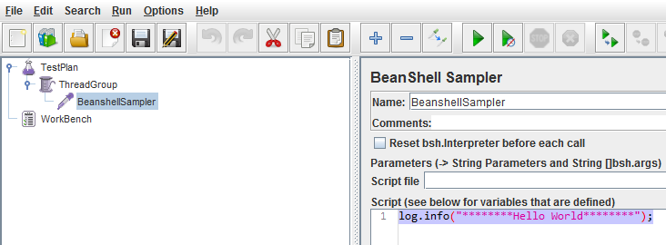

# Java-Ruby-JMeter-Integration
INTRODUCTION
------------------------------------
Apache JMeter is an open-source Java application that allows you to design, build and run performance tests. It is an excellent tool and currently we are using it to analyze our software's performance.  
But being a graphical tool, after building a couple of tests you will notice that most of the test steps were repeated each time. It becomes frustrating and a waste of time and here is when Ruby-JMeter  
comes to the rescue!!! Ruby-JMeter is a tool that allows you to write your JMeter test plan in Ruby and then convert it to a JMX file. Since it is an open-source project, you have the flexibility of extending 
it and customizing it to fit your needs.

**How can this tutorial benefit you?**

The purpose of this tutorial is to show how to integrate ruby-jmeter within a Java project. We are using this integration an in-house Java based benchmark framework that dynamically reads and executes JMX files. 
Another way to benefit from this tutorial is if you want to reference any of the RubyGems from your application. Ruby-jmeter is one of the gems hosted on RubyGems, thus, you can follow the steps defined in the  
2nd part of the tutorial to reference other gems.

**Tutorial Structure**

I have divided this tutorial into three sections. The first one shows how to execute ruby scripts directly from Java; the second section shows how to ruby ruby-jmeter scripts from Java. Whereas the last section 
is dedicated from some refactoring of our test class. 

Executing Ruby Scripts
-------------------------------------

1. **Maven Dependency**

     One of the possible options to run Ruby from Java is by using JRuby. 
     Since we are writing a maven project, then we need to add JRuby dependency in our pom.  
     To do that we just add the following dependency to the dependencies section of our pom.Xml file.        
    
        <dependency>
            <groupId>org.jruby</groupId>
            <artifactId>jruby-complete</artifactId>
            <version>9.0.3.0</version>
        </dependency>

2. **RubyExecutor**

    Now we can reference JRuby in our code, so let us start by adding a new java file "RubyExecutor" to our project.  
    In this class, we will add a static method that takes the full path of the ruby script as a parameter.
    
    Below is the code for the method:     
        
        public class RubyExecutor {
            public static void run(String rubyFile) throws FileNotFoundException, ScriptException {
                final ScriptEngine scriptEngine = new JRubyEngineFactory().getScriptEngine();
                final FileReader rubyFileReader = new FileReader(rubyFilePath);
                scriptEngine.eval(rubyFileReader);
                rubyFileReader.close();
            }
        }
     
    The first line initializes an instance of JRubyEngine. 
    The third line simply calls the eval method that is responsible of executing the ruby code in the JRubyEngine.     
       
3. **Testing our code**  
    The best way to assert our code is working as we want, is by writing JUnit tests. In this case, we can add a new test class RubyExecutorTest.java under "src/test/java".  
    For simplicity, we will make our ruby code generate a new file at the end of its execution. This generated file has the same filename but with "jmx" as an extension.  
    Based on that we should make our test call the method RubyExecutor.run() and assert that a new file has been added.  
    First we should start by writing a simple ruby script in the test-resources folder.  

    *Steps:*  
        3.1. Add a new folder "src/test/resources/RubyExecutor" 
        3.2. Add a new ruby file "simpleCode.rb" under that folder 
        3.3. Add the following code to the Ruby script. This code creates a new empty file with the name "simpleCode.jmx"  
        
        `File.new('target/test-classes/RubyExecutor/simpleCode.jmx', "w+")`
         
     
    Now we write our test  
    
        @Test
        public void
        it_should_generate_a_file_from_ruby_code() throws IOException, ScriptException {
            final String rubyFile = this.getClass().getResource("/RubyExecutor/simpleCode.rb").getFile();
            RubyExecutor.run(rubyFile);
            final File expectedFile = new File(rubyFile.replace("rb", "jmx"));
            Assertions.assertThat(expectedFile).exists();
        }
   
    The test asks the RubyExecutor to execute the ruby script named "simpleCode.rb" (the one we created in previous steps) and asserts that the file "simpleCode.jmx" has been created. 
    Now let us try to run the test using maven command. To do so run the below command from the directory "jruby-jmeter-integration" 
        
        mvn clean install
    
    The tests should be green, and we should get the following success message:  
    
        [INFO] ------------------------------------------------------------------------
        [INFO] BUILD SUCCESS
        [INFO] ------------------------------------------------------------------------
        [INFO] Total time: 01:17 min
    
    We should also notice that the file "simpleCode.jmx" has been created under "target/test-classes/RubyExecutor/" 
    *Note: I use the library org.fest.assertions.Assertions, thus make sure you have added it to your dependencies in maven.*

Executing Ruby-JMeter Scripts
-------------------------------------

Now that we are capable of executing Ruby scripts from our project, we will work on running ruby-jmeter scripts.  

1. **Ruby-JMeter** 

    As stated earlier, ruby-jmeter is a tool that allows you to define your jmeter test-plan in Ruby code. The tool provides methods for most of the JMeter controllers, thus, 
    it is a matter of calling the right method with the right parameters. Upon execution, the tool will generate a JMX file from the Ruby code. 
    I'm not going to dig into details on how it works, for more details you can have a look at some examples available on project's workspace on [GitHub](https://github.com/flood-io/ruby-jmeter) . 

    Now it is time to write a simple test plan with ruby-jmeter. 
    *Steps:*  
        1. Add a new ruby file "src/test/resources/RubyExecutor/simpleJmx.rb"  
        2. Add the following code to the Ruby script:  
    
        require 'rubygems'
        require 'ruby-jmeter'   
        test do
          threads count: 1, rampup: 0, loops: 1, scheduler: false do
            beanshell_sampler query:'log.info("********Hello World********");'
          end
        end.jmx(file: 'target/test-classes/RubyExecutor/simpleJmx.jmx')
     
    This ruby code will do the following: 
    1. Create a test-plan 
    2. Adds a new "Thread Group" with a single thread and single loop count 
    3. Adds a BeanShellSampler as a child of the thread group to print "********Hello World********"  
    4. Saves the test-plan in the file simpleJmx.jmx 
      
    Running the above ruby code will generate the following JMeter test plan:      
     
     
     
    
2. **Ruby-JMeter within our maven project** 
    Now we know exactly what our code should do; what are its input and output. So, it would be great if we write a JUnit test to check if our code has indeed generated a JMX file from the Ruby script 
    we wrote in the previous section. So our test should execute the ruby script and is expected to generate the respective JMX file ("target/test-classes/RubyExecutor/simpleJmx.jmx") at the end of the execution. 
    Based on this, we can add a new test to RubyExecutorTest.java 
    
        @Test
        public void
        it_should_generate_a_jmx_file_from_ruby_code() throws IOException, ScriptException {
            final String rubyFile = this.getClass().getResource("/RubyExecutor/simpleJmx.rb").getFile();
            RubyExecutor.run(rubyFile);
            final File expectedFile = new File(rubyFile.replace("rb", "jmx"));
            Assertions.assertThat(expectedFile).exists();
        }
       
    Let us give this a try:
     
        mvn clean install
        
    Unfortunately if fails: 

        LoadError: no such file to load -- ruby-jmeter
            require at org/jruby/RubyKernel.java:939
            require at uri:classloader:/META-INF/jruby.home/lib/ruby/stdlib/rubygems/core_ext/kernel_require.rb:54
                <top> at <script>:2
            Tests run: 2, Failures: 0, Errors: 1, Skipped: 0, Time elapsed: 11.657 sec <<< FAILURE!
            it_should_generate_a_jmx_file_from_ruby_code(RubyExecutorTest)  Time elapsed: 11.446 sec  <<< ERROR!
            javax.script.ScriptException: org.jruby.embed.EvalFailedException: (LoadError) no such file to load -- ruby-jmeter
                at org.jruby.embed.jsr223.JRubyEngine.wrapException(JRubyEngine.java:104)
                at org.jruby.embed.jsr223.JRubyEngine.eval(JRubyEngine.java:121)
                at org.jruby.embed.jsr223.JRubyEngine.eval(JRubyEngine.java:146)

    The exception is telling us that it couldn't execute ruby-jmeter. Maven wasn't able to locate the ruby-jmeter libraries as we haven't referenced it yet in any of our code. 
    To fix this problem, we will have to add more dependencies to our pom file!  
    
3. **Ruby-Gems Dependency** 
    RubyGems is a repository hosting Ruby community's gems. Once referenced, Maven will access this repository to sync the required ruby libraries locally to your project. 
    In our case we are using the ruby-jmeter gems to add dependency on that we should modify our pom file as follows: 
    RubyGems is a repository hosting ruby community's gems. Once referenced, maven will access this repository to sync the required ruby libraries locally to your project. 
    
    1. Add repository: This will be used by maven to download the gems from the specified URL  
    
        <repositories>
            <repository>
                <id>rubygems-releases</id>
                <url>http://rubygems-proxy.torquebox.org/releases</url>
            </repository>
        </repositories>
    
    3.2. Add dependency to ruby-jmeter
    
        <dependency>
            <groupId>rubygems</groupId>
            <artifactId>ruby-jmeter</artifactId>
            <version>2.13.8</version>
            <type>gem</type>
        </dependency>
    
    3.3. Add a build step: 
    
        <build>
            <plugins>
                <plugin>
                    <groupId>de.saumya.mojo</groupId>
                    <artifactId>gem-maven-plugin</artifactId>
                    <version>1.1.3</version>
                    <extensions>true</extensions>
                    <executions>
                        <execution>
                            <goals>
                                <goal>initialize</goal>
                            </goals>
                        </execution>
                    </executions>
                    <configuration>
                        <includeRubygemsInResources>true</includeRubygemsInResources>
                    </configuration>
                </plugin>
            </plugins>
        </build>
       
    3.4. Rerun maven
    
        mvn clean install
    
    Now we should get a "Build Success."
    
        -------------------------------------------------------
         T E S T S
        -------------------------------------------------------
        Running RubyExecutorTest
        I, [2015-12-23T17:27:19.643000 #7564]  INFO -- : Test plan saved to: target/test-classes/RubyExecutor/simpleJmx.jmx
        Tests run: 2, Failures: 0, Errors: 0, Skipped: 0, Time elapsed: 7.278 sec
        Results :
        Tests run: 2, Failures: 0, Errors: 0, Skipped: 0
        [INFO]
        [INFO] --- maven-jar-plugin:2.4:jar (default-jar) @ java-ruby-jmeter-integration ---
        [INFO] Building jar: D:\Dev\java\workspace\GitHub\sample-projects\jruby-jmeter-integration\target\java-ruby-jmeter-integration-1.0-SNAPSHOT.jar
        [INFO]
        [INFO] --- maven-install-plugin:2.4:install (default-install) @ java-ruby-jmeter-integration ---
        [INFO] Installing D:\Dev\java\workspace\GitHub\sample-projects\jruby-jmeter-integration\target\java-ruby-jmeter-integration-1.0-SNAPSHOT.jar to D:\Dev\maven_repo\aatwi\github\java-ruby-jmeter-integration\1.0-SNAPSHOT\java-ruby-jmeter-integration-1.0-SNAPSHOT.jar
        [INFO] Installing D:\Dev\java\workspace\GitHub\sample-projects\jruby-jmeter-integration\pom.xml to D:\Dev\maven_repo\aatwi\github\java-ruby-jmeter-integration\1.0-SNAPSHOT\java-ruby-jmeter-integration-1.0-SNAPSHOT.pom
        [INFO] ------------------------------------------------------------------------
        [INFO] BUILD SUCCESS
        [INFO] ------------------------------------------------------------------------
           
Code Refactoring
-------------------------------------

The last part of this tutorial is to do some code refactoring to our test class. Although it isn't essential here, it became a habit for me!! 
If we look at our current code, we can notice that there is some code duplication in the two tests. 
One thing we can do here is extracting the method "assertJmxFileExists" to remove this duplication. 
Our new method will take the responsibility of calling RubyExecutor.run and asserting the generation of the JMX file. 
The code below shows the difference before and after refactoring.     
    Before Refactoring:
    
    @Test
    public void
    it_should_generate_a_file_from_ruby_code() throws IOException, ScriptException {
        final String rubyFile = this.getClass().getResource("/RubyExecutor/simpleCode.rb").getFile();
        RubyExecutor.run(rubyFile);
        final File expectedFile = new File(rubyFile.replace("rb", "jmx"));
        Assertions.assertThat(expectedFile).exists();
    }  
    
    @Test
    public void
    it_should_generate_a_jmx_file_from_ruby_code() throws IOException, ScriptException {
        final String rubyFile = this.getClass().getResource("/RubyExecutor/simpleJmx.rb").getFile();
        RubyExecutor.run(rubyFile);
        final File expectedFile = new File(rubyFile.replace("rb", "jmx"));
        Assertions.assertThat(expectedFile).exists();
    }
 
    After Refactoring:

    @Test
    public void
    it_should_generate_a_file_from_ruby_code() throws IOException, ScriptException {
        assertJmxFileExists("simpleCode.rb");
    }
    
    @Test
    public void
    it_should_generate_a_jmx_file_from_ruby_code() throws IOException, ScriptException {
        assertJmxFileExists("simpleJmx.rb");
    }
    
    private void assertJmxFileExists(final String rubyScript) throws IOException, ScriptException {
        final String rubyFile = this.getClass().getResource("/RubyExecutor/" + rubyScript).getFile();
        RubyExecutor.run(rubyFile);
        final File expectedJmxFile = new File(rubyFile.replace("rb", "jmx"));
        Assertions.assertThat(expectedJmxFile).exists();
    }
    
We can do more refactoring, but I think it is not worth at this point. The code is simple and can be easily read and understood. 
Finally, rerun maven to make sure that nothing was broken with this refactoring. 
      
**References** 
[my blog post](http://ahmadatwi.me/2015/12/27/how-to-reference-ruby-jmeter-from-java-project/) 
[ruby-jmeter](https://github.com/flood-io/ruby-jmeter)  
[Apache Jmeter](http://jmeter.apache.org/) 
[RubyGems](https://rubygems.org/) 